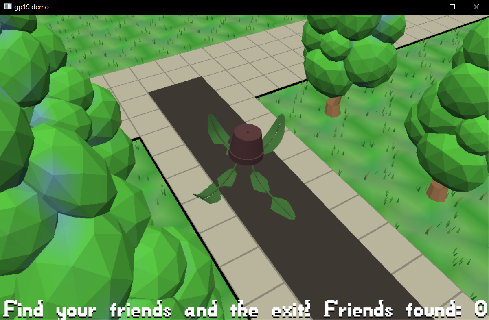

# (Plant and Maze)

Author: (Jiechen Li)

Design: (TODO: In two sentences or fewer, describe what is new and interesting about your game.)

This is a very big maze and you are a plant! So are your friends! Your target is to find your for friends and get out of this maze.
(I'm tring to design a more attractive character. But I find the plant from the base code is extremly suitable in this maze. So I finally choose to use the plant rather than my ugly creeper. You can find it in creeper.png.)

Screen Shot:

How To Play:

You can use your keyboard to control the next step.
'←' means you choose to go left.
'→' means you choose to go right.
'↑' means you choose to go up.
'↓' means you choose to go down.
The target of this game to get out of this maze with your friends. You need to find your four friends first. After that, you can find the exit.
The exit is at the end of a road. But if you did't find all your friends and go to the exit, you cannot realize it's a exit because of no notification.
Remeber! Find your friends! Then go to the end of a road!

Sources:

Art Sources:
https://www.turbosquid.com/3d-models/blender-carrot-crystal-oak-tree-3d-model-1189852

Sound Sources:
https://freesound.org/people/YellowTree/sounds/483907/

This game was built with [NEST](NEST.md).